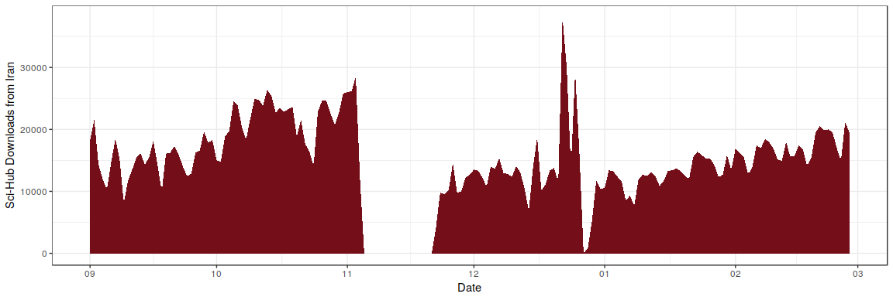

    knitr::opts_chunk$set(
      fig.width=10,
     message=FALSE,
     warning=FALSE,
     fig.path='figure/',
     fig.cap = "", 
     echo = TRUE,
     warning = FALSE, 
     message = FALSE
    )

Install the required packages:

    options(stringsAsFactors = FALSE)

    # install required packages
    # install.packages("tidyverse")
    # install.packages("rcrossref")
    library('tidyverse')
    library('rcrossref')

Load Sci-Hub Data into R
------------------------

The SciHub paper:

Bohannon J (2016) Who's downloading pirated papers? Everyone. Science
352(6285): 508-512. <https://doi.org/10.1126/science.352.6285.508>

The associated dataset:

Elbakyan A, Bohannon J (2016) Data from: Who's downloading pirated
papers? Everyone. Dryad Digital Repository.
<https://doi.org/10.5061/dryad.q447c>

To load the dataset, download the file from the Dryad landing page, or
directly from
[here](http://datadryad.org/bitstream/handle/10255/dryad.114259/scihub_data.zip?sequence=1).

After downloading the data, copy the folder `scihub_data` into a new
`data` folder:

To load one file representing one month, simply type:

    my_data <- readr::read_tsv(file = "data/scihub_data/dec2015.tab", col_names = FALSE)

Now let's inspect the data:

    my_data

    ## # A tibble: 3,879,511 x 6
    ##                     X1                               X2            X3
    ##                 <time>                            <chr>         <chr>
    ## 1  2015-12-01 00:00:00        10.1080/00423110701422426 56ed2c3981074
    ## 2  2015-12-01 00:00:03 10.1111/j.1365-2222.2010.03601.x 56ed2b55bf5b4
    ## 3  2015-12-01 00:00:04        10.1007/978-1-4684-0274-2 56ed2b36d7d70
    ## 4  2015-12-01 00:00:04       10.1016/j.ejor.2003.11.032 56ed2c3981124
    ## 5  2015-12-01 00:00:05        10.1049/iet-cdt.2014.0146 56ed9ff1c5403
    ## 6  2015-12-01 00:00:06          10.1073/pnas.1512683112 56ed2c2a0ce6c
    ## 7  2015-12-01 00:00:06       10.1109/MIKON.2002.1017863 56ed2b0ebb3e1
    ## 8  2015-12-01 00:00:07    10.1016/S1368-8375(02)00010-6 56ed2b011ac68
    ## 9  2015-12-01 00:00:08 10.1034/j.1600-048X.2003.03020.x 56ed2b4eb8c73
    ## 10 2015-12-01 00:00:08    10.1016/S0167-7012(00)00219-0 56ed2bffa7e9c
    ## # ... with 3,879,501 more rows, and 3 more variables: X4 <chr>, X5 <chr>,
    ## #   X6 <chr>

Is it clean?

    library(dplyr)
    my_data %>% 
      dplyr::group_by(X4) %>% 
      dplyr::summarise(Counts = n()) %>%
      dplyr::arrange(desc(Counts))

    ## # A tibble: 179 x 2
    ##               X4 Counts
    ##            <chr>  <int>
    ## 1          China 642602
    ## 2           Iran 423213
    ## 3          India 398111
    ## 4         Russia 220480
    ## 5  United States 214228
    ## 6          Egypt 159465
    ## 7      Indonesia 102955
    ## 8         Brazil  96381
    ## 9            N/A  86057
    ## 10       Morocco  82212
    ## # ... with 169 more rows

It looks clean, great!

Well, the data is huge and you might run out of memory if you try to
load the whole dataset. So, let's subset our data and save it to your
disk. Let's define a function:

    my_helper <- function(file = NULL) {
      tt <- readr::read_tsv(file = file, col_names = FALSE) %>%
      dplyr::filter(X4 == "Iran")
      file_name <- gsub(".tab", "_iran.csv", file)
      write.csv(tt,  file_name, row.names = FALSE)
    }

Get files

    my_files <- list.files("data/scihub_data/", pattern = "tab")
    my_files <- paste0("data/scihub_data/", my_files)

And apply it

    sapply(my_files, my_helper)

    ## $`data/scihub_data/dec2015.tab`
    ## NULL
    ## 
    ## $`data/scihub_data/feb2016.tab`
    ## NULL
    ## 
    ## $`data/scihub_data/jan2016.tab`
    ## NULL
    ## 
    ## $`data/scihub_data/nov2015.tab`
    ## NULL
    ## 
    ## $`data/scihub_data/oct2015.tab`
    ## NULL
    ## 
    ## $`data/scihub_data/sep2015.tab`
    ## NULL

We now have the subset on our local disk. Let's load in the whole
Iranian usage events.

    my_files <- list.files("data/scihub_data/", pattern = "iran")
    my_files <- paste0("data/scihub_data/", my_files)

    sci_hub_ir <- NULL

    for (i in my_files) {
      my_data <- readr::read_csv(file = i)
      sci_hub_ir <- rbind(sci_hub_ir, my_data)
    }

So, let's inspect the data frame and save a local copy

    sci_hub_ir

    ## # A tibble: 2,631,035 x 6
    ##                     X1                             X2            X3    X4
    ## *               <time>                          <chr>         <chr> <chr>
    ## 1  2015-12-01 00:00:05      10.1049/iet-cdt.2014.0146 56ed9ff1c5403  Iran
    ## 2  2015-12-01 00:00:08   10.1016/j.apsusc.2015.05.185 56ed2c38b0cbc  Iran
    ## 3  2015-12-01 00:00:09              10.1021/jp404207x 56ed2c396a16c  Iran
    ## 4  2015-12-01 00:00:13   10.1016/0957-4158(91)90024-5 56ed2c397970f  Iran
    ## 5  2015-12-01 00:00:15  10.1016/S0167-6105(97)00220-1 56ed2c381399b  Iran
    ## 6  2015-12-01 00:00:24     10.1016/j.ejor.2007.03.011 56ed2c3731b6d  Iran
    ## 7  2015-12-01 00:00:35      10.1007/s11418-015-0931-7 56ed2b4d23a81  Iran
    ## 8  2015-12-01 00:00:44 10.1007/978-3-642-36197-5_60-1 56ed2c3974529  Iran
    ## 9  2015-12-01 00:00:46     10.1016/j.ejps.2005.04.010 56ed2c3968813  Iran
    ## 10 2015-12-01 00:00:49              10.1021/ja208256u 56ed2b4017fd3  Iran
    ## # ... with 2,631,025 more rows, and 2 more variables: X5 <chr>, X6 <chr>

    write.csv(sci_hub_ir, "data/iran.csv", row.names = FALSE)

Analysis
--------

Possible questions:

What is the usage by:

-   month
-   city
-   subject (defined by publishers at the journal level, might be a
    bit messy)
-   journal
-   publisher

To get subject, journal and publisher information, we need to use data
from Crossref based on the DOI.

Fetching data from Crossref with the `rcrossref` package
--------------------------------------------------------

We could use [rcrossref](https://github.com/ropensci/rcrossref) to fetch
information on:

-   subject (defined by publishers at the journal level, might be a
    bit messy)
-   journal
-   publisher

Make sure to install `rcrossref` from CRAN

    install.packages("rcrossref")
    library(rcrossref)

And now get metadata for a sample of 10 publications

    my_dois <- sample(sci_hub_ir$X2, 10)

And now fetch the metadata

    my_md <- rcrossref::cr_works(my_dois)

And let's inspect it:

    my_md$data

    ## # A tibble: 10 x 31
    ##                   alternative.id
    ##                            <chr>
    ## 1                               
    ## 2  10.1080/08961530.2015.1072075
    ## 3              S0924013607008941
    ## 4                               
    ## 5              10.1021/ie401524g
    ## 6              S0257897213001151
    ## 7              S0143974X04001476
    ## 8                               
    ## 9                               
    ## 10             S0920410514001387
    ## # ... with 30 more variables: container.title <chr>, created <chr>,
    ## #   deposited <chr>, DOI <chr>, funder <list>, indexed <chr>, ISBN <chr>,
    ## #   ISSN <chr>, issued <chr>, link <list>, member <chr>, prefix <chr>,
    ## #   publisher <chr>, reference.count <chr>, score <chr>, source <chr>,
    ## #   subject <chr>, title <chr>, type <chr>, URL <chr>, assertion <list>,
    ## #   author <list>, issue <chr>, page <chr>, update.policy <chr>,
    ## #   volume <chr>, license_date <chr>, license_content.version <chr>,
    ## #   license_delay.in.days <chr>, license_URL <chr>

Wow, very comprehensive!

### Usage by date

First step: Transform to dates

    sci_hub_ir <- sci_hub_ir %>% 
      dplyr::mutate(date = format(sci_hub_ir$X1, "%Y-%m-%d"))

Second step: Create summary of events per day

    ir_per_date <- sci_hub_ir %>% 
      group_by(date) %>% 
      summarize(events = n())
    ir_per_date

    ## # A tibble: 164 x 2
    ##          date events
    ##         <chr>  <int>
    ## 1  2015-09-01  18262
    ## 2  2015-09-02  21550
    ## 3  2015-09-03  14367
    ## 4  2015-09-04  11940
    ## 5  2015-09-05  10293
    ## 6  2015-09-06  14650
    ## 7  2015-09-07  18487
    ## 8  2015-09-08  15278
    ## 9  2015-09-09   8112
    ## 10 2015-09-10  11739
    ## # ... with 154 more rows

Well, we know that there are missing values in November. Let's deal with
it

    # make a date sequence as data.frame
    my_dates <- seq(as.Date("2015-09-01"), as.Date("2016-02-28"), by = "day")
    my_dates <- as.data.frame(my_dates)
    # merge it
    ir_per_date$date <- as.Date(ir_per_date$date)
    ir_t <- right_join(ir_per_date, my_dates, by = c("date" = "my_dates"))
    # deal with empty values  
    ir_t$events[is.na(ir_t$events)] <- 0

Let's plot:

    ggplot(ir_t, aes(as.Date(date), events, group = 1)) + 
      geom_area(fill = "#740e18") + 
      scale_x_date(date_breaks = "1 month", date_labels = "%m") + 
      xlab("Date") +
      ylab("Sci-Hub Downloads from Iran") +
      theme_bw()

Show the top 10 busiest days as well.

    ir_per_date %>% arrange(desc(events))

    ## # A tibble: 164 x 2
    ##          date events
    ##        <date>  <int>
    ## 1  2015-12-22  38069
    ## 2  2015-12-23  29941
    ## 3  2015-12-25  29261
    ## 4  2015-11-03  28498
    ## 5  2015-10-13  26417
    ## 6  2015-11-02  26155
    ## 7  2015-11-01  26035
    ## 8  2015-10-31  25781
    ## 9  2015-10-14  25387
    ## 10 2015-10-10  24911
    ## # ... with 154 more rows

Wow, usage in Iran peaked around christmas. Why?
